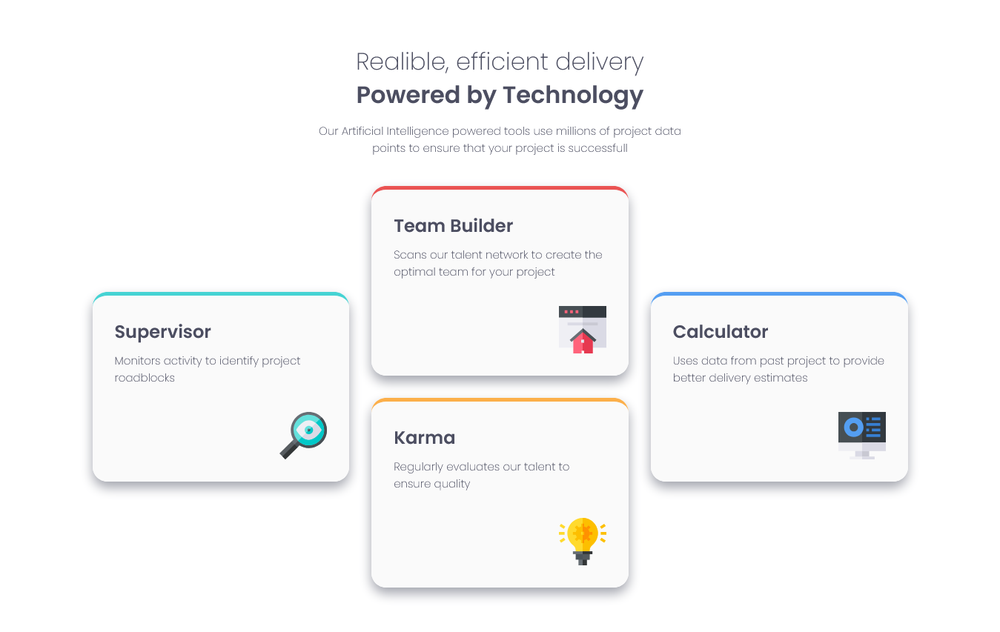

# Frontend Mentor - Four card feature section solution

This is a solution to the [Four card feature section challenge on Frontend Mentor](https://www.frontendmentor.io/challenges/four-card-feature-section-weK1eFYK). Frontend Mentor challenges help me improve my coding skills by building realistic projects.

## Table of contents

- [Overview](#overview)
  - [Screenshot](#screenshot)
  - [Links](#links)
- [My process](#my-process)
  - [Built with](#built-with)
  - [What I learned](#what-i-learned)
- [Author](#author)

## Overview

### Screenshot

### Links

- Live Site URL: [Four card feature section Awan](https://four-card-feature-fem-eight.vercel.app/)

## My process

### Built with

- Semantic HTML5 markup
- Google Fonts
- CSS Grid

### What I learned

In this project I learned how to use css grid for layouting and set the responsive.

## Author

- Frontend Mentor - [@soniawan](https://www.frontendmentor.io/profile/soniawan)
